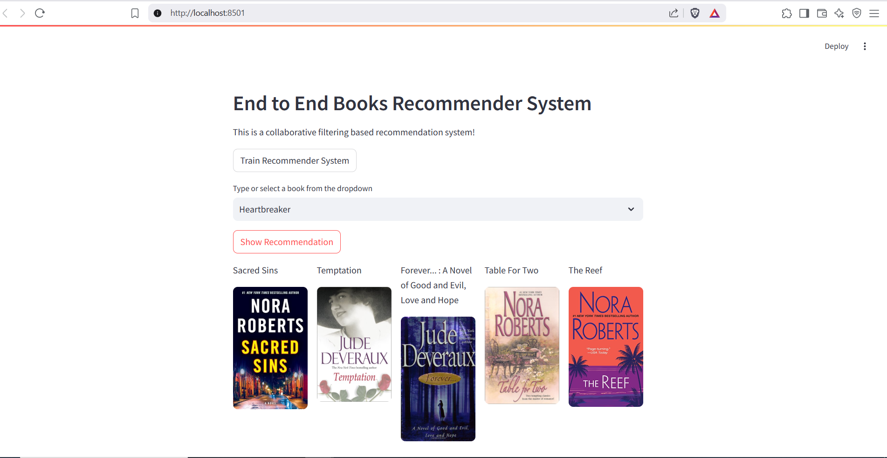

📚 E-Commerce Book Recommendation System
Demo

Table of Contents
Introduction

Features

Requirements

How to Run

Deployment

Model Training

Model Evaluation

Model Deployment

Future Improvements

Contributing

License

Acknowledgments

Contact

🚀 Introduction
This is an end-to-end Book Recommendation System built using Python, Pandas, NumPy, and Scikit-learn. The system uses a Collaborative Filtering approach to recommend books to users based on their past ratings.

✨ Features
📚 Book recommendations based on user ratings

👥 User-based Collaborative Filtering algorithm

🌐 Deployment using Streamlit and Docker

☁️ Easy deployment on AWS EC2 instances

🛠️ Requirements
Python 3.11

Pandas

NumPy

Scikit-learn

Streamlit

Docker

🚀 How to Run
Clone the Repository
bash
Copy
Edit
git clone https://github.com/santosh3110/E-Commerce-book-recommendation-system.git
cd E-Commerce-book-recommendation-system
Create a Conda Environment
bash
Copy
Edit
conda create -n books python=3.11 -y
conda activate books
Install the Requirements
bash
Copy
Edit
pip install -r requirements.txt
Run the Application Locally
bash
Copy
Edit
streamlit run app.py
Visit http://localhost:8501 to see the app running!

☁️ Deployment
Deploy on AWS EC2 using Docker
After launching your EC2 instance and installing Docker:

Update and install Docker:

bash
Copy
Edit
sudo apt-get update -y
sudo apt-get upgrade -y
curl -fsSL https://get.docker.com -o get-docker.sh
sudo sh get-docker.sh
sudo usermod -aG docker ubuntu
newgrp docker
Clone the repository:

bash
Copy
Edit
git clone https://github.com/santosh3110/E-Commerce-book-recommendation-system.git
cd E-Commerce-book-recommendation-system
Build the Docker image:

bash
Copy
Edit
docker build -t santosh3110/bookapp:latest .
Run the Docker container:

bash
Copy
Edit
docker run -d -p 8501:8501 santosh3110/bookapp
Push your Docker image to Docker Hub (optional):

bash
Copy
Edit
docker login
docker push santosh3110/bookapp:latest
Optional cleanup commands:

bash
Copy
Edit
docker ps                # List running containers
docker stop <container_id>  # Stop container
docker rm $(docker ps -a -q)  # Remove all containers
docker rmi santosh3110/bookapp:latest  # Remove image locally
docker pull santosh3110/bookapp        # Pull your pushed image

🧠 Model Training
The model is trained using Collaborative Filtering with the Nearest Neighbors algorithm from Scikit-learn to find similar users based on their book ratings.

🚀 Model Deployment
The application is deployed using Streamlit inside a Docker container and can be hosted on AWS EC2 or any cloud provider.

🌟 Future Improvements
Implement advanced Collaborative Filtering techniques like Matrix Factorization.

Incorporate metadata features such as book genres, authors, etc.

Improve evaluation with more robust metrics like Mean Average Precision (MAP).

🤝 Contributing
Contributions are welcome!
Feel free to submit a pull request with your improvements, bug fixes, or ideas.

📜 License
This project is licensed under the Apache 2.0 License.

📬 Contact
For any questions or feedback, feel free to reach out:
GitHub: santosh3110

🎯
⭐ Don't forget to star the repo if you find it useful!

